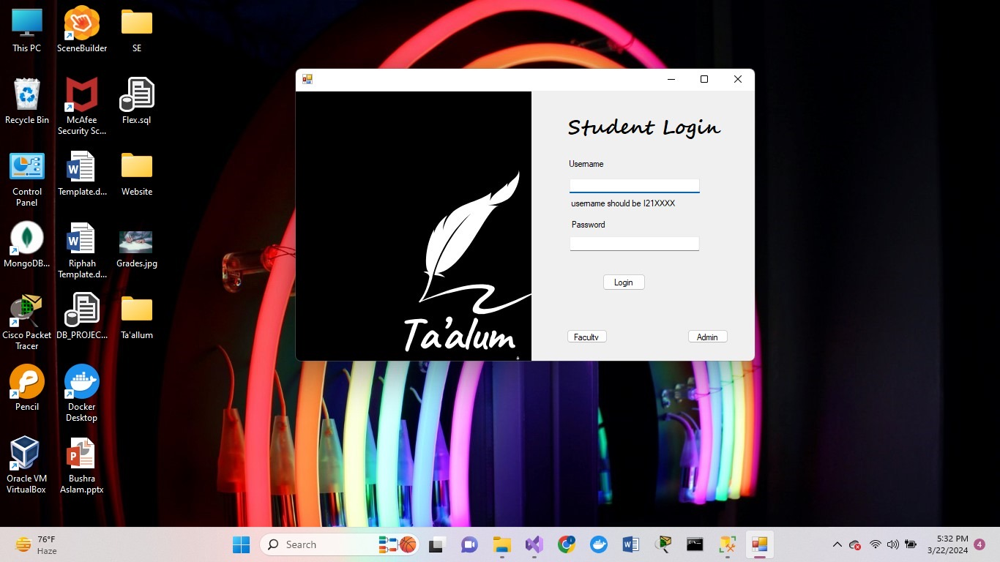

# Project Title: Ta’allum
**Project Type:** Desktop App  
**Project Topic:** University Learning Management System

## Problem Statement
The existing University Learning Management System (LMS) faces significant challenges, notably the absence of crucial features that hinder effective communication and organization. One prominent issue is the lack of information regarding teachers' office hours, which plays a pivotal role in students' academic support and engagement. Without this essential feature, students struggle to connect with instructors, seek clarifications, or schedule appointments for additional assistance.

Additionally, the current LMS fails to incorporate a comprehensive display of students' timetables. This omission hampers efficient coordination and planning, making it difficult for both students and faculty to synchronize their schedules for meetings, group projects, or other collaborative activities. The absence of a clear and accessible overview of students' timetables impedes the seamless integration of academic and extracurricular commitments, potentially leading to missed opportunities for collaboration and hindering overall productivity within the academic community. Addressing these issues is crucial for enhancing the functionality and user experience of the University LMS.

## Problem Solution and Scope
Traditional university education systems face challenges. Ta’allum, a comprehensive learning system, addresses these issues with modern software engineering. It includes modules for teachers to manage courses, assessments, and attendance, while students can enroll, access content, and track progress. Key features like user authentication, intuitive dashboards, communication tools, analytics, and scalability ensure a seamless learning experience, promoting efficiency, engagement, and accountability. The scope of this project is students and teachers of the university.

## Project Features

### Teacher’s Interface

**Course Management Module**  
Facilitates the organization and dissemination of course materials, allowing instructors to efficiently add and manage content for student learning.

**Grading and Assessment Module**  
Streamlines the process of evaluating student performance by providing tools to manage assignments, quizzes, and exams, ensuring accurate and timely grading.

**Attendance Tracking Module**  
Enables instructors to monitor and track student attendance, ensuring accountability and facilitating effective communication regarding class participation.

### Student’s Interface

**Course Enrollment Module**  
Empowers students to seamlessly register for courses and access class schedules, as well as view teacher office hours for additional support and guidance.

**Content Access Module**  
Provides students with easy access to lecture materials and facilitates assignment submissions, promoting a seamless learning experience.

**Tracking Module**  
Allows students to monitor their academic progress by providing insights into grades and attendance records, facilitating self-assessment and goal setting.

## Setup Instructions
To set up the Ta’allum project in Visual Studio:

1. **Open Visual Studio:**
   - Launch Visual Studio.

2. **Create a New Project:**
   - Select "Create a new project."
   - Choose "Windows Forms App (.NET)" from the list of project templates.
   - Click "Next."

3. **Configure Your Project:**
   - Name your project "Ta’allum."
   - Choose a location to save your project.
   - Click "Create."

4. **Add Existing Files:**
   - Right-click on the project in the Solution Explorer.
   - Select "Add" > "Existing Item..."
   - Navigate to the directory where your project files are located.
   - Select all relevant files and click "Add."
   - You can also add "Web form" one by one and copy the desdired code from the files.
   - Dont forget to change the SQL Connection String

5. **Build the Solution:**
   - Go to the "Build" menu and select "Build Solution."

6. **Run the Application:**
   - Press `F5` or select "Start Debugging" from the "Debug" menu.

7. **Configure Database Connection:**
   - Update the connection string in the configuration file to match your SQL Server settings.

## Contribution Guidelines
- Fork the repository.
- Create a new branch for your feature or bug fix.
- Commit your changes and push to your branch.
- Submit a pull request for review.

## License
This project is licensed under the MIT License.

---

We value and celebrate diversity and strive to create an inclusive work environment for all. We welcome applicants from all backgrounds and are committed to providing equal opportunities. Should you require any accommodations during the recruitment process, please submit an Accommodations Request Form, and we will work together to meet your needs.
